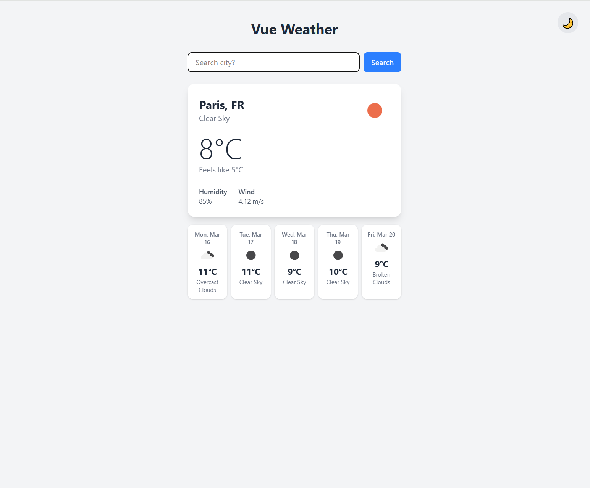

# Vue Weather

A simple weather app built with Vue 3, TypeScript, and Tailwind CSS.

🌤️ **[Live Demo](https://vue-typescript-weather-app.vercel.app/)**



## Tech Stack

- **Vue 3** — Composition API with `<script setup>`
- **TypeScript** — Full type safety including API response types
- **Vite** — Build tooling and dev server
- **Tailwind CSS v4** — Utility-first styling with dark mode
- **OpenWeatherMap API** — Current weather and 5-day forecast data

## Features

- Search weather by city
- Current conditions — temperature, feels like, humidity, wind speed
- 5-day forecast
- Dark mode toggle

## Getting Started

1. Clone the repo
2. Create a `.env` file in the root with your OpenWeatherMap API key:
```
   VITE_WEATHER_API_KEY=your_api_key_here
```
3. Install dependencies and run:
```bash
   npm install
   npm run dev
```